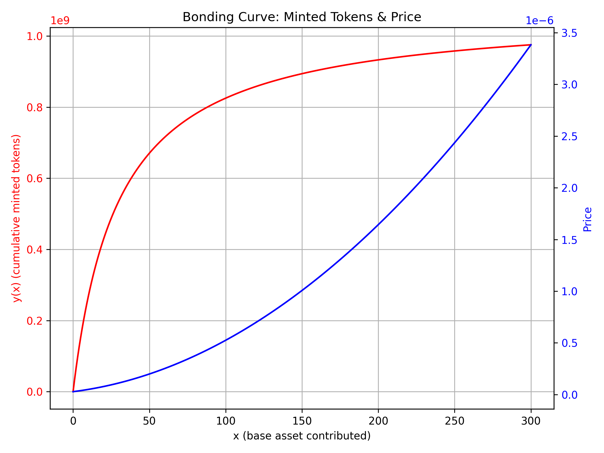

# Bonding Curve – Solana
A bonding curve program with enhanced features for the Xyber project. Includes token locking logic, liquidity pool creation, and more. 


## Formula

We used the following formula to define the bonding curve:

**y(x) = A - K / (C + x)**

This formula represents the cumulative minted tokens (y) as a function of the base asset contributed (x). The parameters are:

- **A**: Maximum number of tokens (asymptotic limit)
- **K**: Determines the "speed" of approaching the maximum
- **C**: Virtual pool or offset value

For visualization, a script is available in the `qa` folder that generates the curve. 

### Example Visualization

Below is an example of the bonding curve:



## Bonding Curve Test Overview

This test suite runs through a **three-step** scenario to verify the bonding curve logic, ensuring all the main operations function as intended:

1. **Create + Init Escrow + Mint Initial + Set Metadata**
   - [x] Generates new PDAs (OwnedToken, Escrow, Metadata)
   - [x] Creates the mint and associated token account (ATA) for the creator
   - [x] Mints initial tokens using the bonding curve
   - [x] Sets on-chain metadata (token name, symbol, URI)

2. **Buyer Purchases Tokens** 
   - [x] Creates/buys tokens with 0.001 SOL deposit
   - [x] Checks that a buyer ATA is properly initialized (via `init_if_needed`)
   - [x] Verifies minted tokens in buyer’s ATA
   - [x] Ensures `OwnedToken` supply is decreased in “raw token” units, matching minted base units

3. **Buyer Sells Tokens**
   - [x] Burns half of the buyer’s tokens 
   - [x] Calls bonding curve to compute how much SOL to return
   - [x] Transfers SOL from escrow back to buyer
   - [x] Verifies the supply is updated correctly, exactly matching burned tokens 
   - [x] Confirms buyer’s ATA balance is reduced as expected

**Key Assertions**:
- No integer overflow when computing minted or burned tokens
- Supply changes align with minted/burned amounts (scaling by `10^9` if decimals=9)
- ATA balances update correctly, verifying deposit/withdraw flows
- The entire flow uses `init_if_needed` for creating ATAs, avoiding errors like `TokenAccountNotFoundError`

This approach tests all crucial parts of the bonding curve:
- **Initialization** (PDA creation, escrow, metadata),
- **Buying** tokens with a partial SOL deposit,
- **Selling** tokens back for SOL,
- **Supply** checks at each step to ensure the raw token count and base units remain in sync.

## TODO

- [ ] Add a negative test to verify behavior when attempting to mint more tokens than the remaining `ownedToken.supply` allows (e.g. check `InsufficientTokenSupply` error).
- [ ] Explore edge cases for integer overflow/underflow, e.g. extremely large `lamports` inputs.
- [ ] Confirm behavior when `sell_instruction` receives tokensIn > actual minted tokens.

### Testing Instructions

Below are common commands and steps for testing Solana programs in both local and devnet environments.

Note: Tests may not fully run on localnet at this time because the Metaplex program is required on localnet. For that reason, tests can currently only be run in full on devnet.

It may also be useful to note that after generating your devnet wallet, you can add its key array directly to Phantom so you can see tokens appear in your wallet.

preparing to Deploy with a Custom Configured Keypair
```
solana-keygen new --outfile target-deploy-keypair.json
solana-keygen pubkey target-deploy-keypair.json
anchor deploy --program-name bonding_curve --program-keypair target-deploy-keypair.json
```

Get addresses and faucet tokens
```
solana address --keypair ~/.config/solana/devnet-owner.json
solana address --keypair ~/.config/solana/devnet-buyer.json
```

Get current balance
```
solana address --keypair ~/.config/solana/devnet-owner.json | solana balance
solana address --keypair ~/.config/solana/devnet-buyer.json | solana balance
```

---

### 1. Generate dev-net keypair
```bash
solana-keygen new --outfile ~/.config/solana/devnet-owner.json
solana-keygen new --outfile ~/.config/solana/devnet-buyer.json
```

### 2. Airdrop More Than the Daily Limit on Devnet
If you need more than the default devnet faucet limit, register at [Solana Faucet](https://faucet.solana.com/) with your GitHub account to request larger amounts of SOL.

### 3. Airdrop on Localnet
```bash
solana airdrop 10 <YOUR_WALLET_ADDRESS> --url http://127.0.0.1:8899
```

### 4. Switch Between Devnet and Localnet
```bash
# Set CLI to Devnet
solana config set --url devnet

# Or set CLI to Localnet
solana config set --url http://127.0.0.1:8899
```

### 5. Get Your Solana Address and Check Balance
```bash
solana address
solana balance
```

### 6. Build and Deploy Solana Program
```bash
anchor build
anchor deploy

# or
make bd
```

### 7. Run a Local Validator and Tests
```bash
solana-test-validator
anchor test --skip-local-validator
```

### 8. Run Tests on Devnet
```bash
anchor test --provider.cluster devnet
#or
anchor test --skip-build --skip-deploy --provider.cluster devnet
#or
make test-dev
```

### 9. Standard Testing (Localnet Auto-Spawned)
```bash
anchor test
```